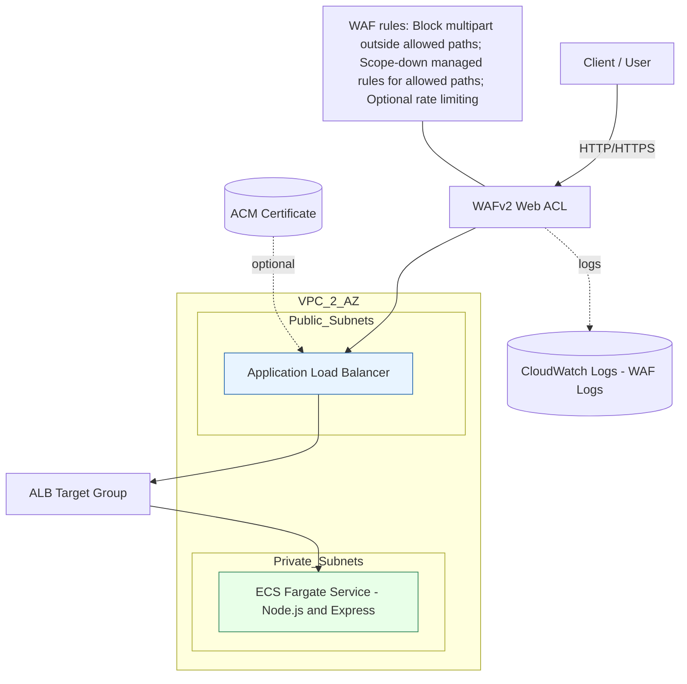

# アーキテクチャ図（Mermaid）

以下は GitHub や VS Code の Markdown プレビューでそのまま表示できます。

```mermaid
%% Mermaid architecture diagram: ALB + WAF + ECS (Fargate)
%% Render in GitHub preview, Mermaid Live, or VS Code Mermaid extension

flowchart TD
  U[Client / User] -->|HTTP/HTTPS| WAF[WAFv2 Web ACL]
  WAF --> ALB[Application Load Balancer]
  ALB --> TG[ALB Target Group]
  TG --> ECS[ECS Fargate Service - Node.js and Express]

  %% Logging
  WAF -. logs .-> CWL[(CloudWatch Logs - WAF Logs)]

  %% Optional certificate
  ACM[(ACM Certificate)] -. optional .-> ALB

  %% Network layout
  subgraph VPC_2_AZ
    direction TB
    subgraph Public_Subnets
      ALB
    end
    subgraph Private_Subnets
      ECS
    end
  end

  classDef public fill:#e8f4ff,stroke:#2b6cb0,stroke-width:1px;
  classDef private fill:#e8ffe8,stroke:#2f855a,stroke-width:1px;
  class ALB public;
  class ECS private;

  %% Notes
  note1[WAF rules: Block multipart outside allowed paths; Scope-down managed rules for allowed paths; Optional rate limiting]
  note1 --- WAF
```
